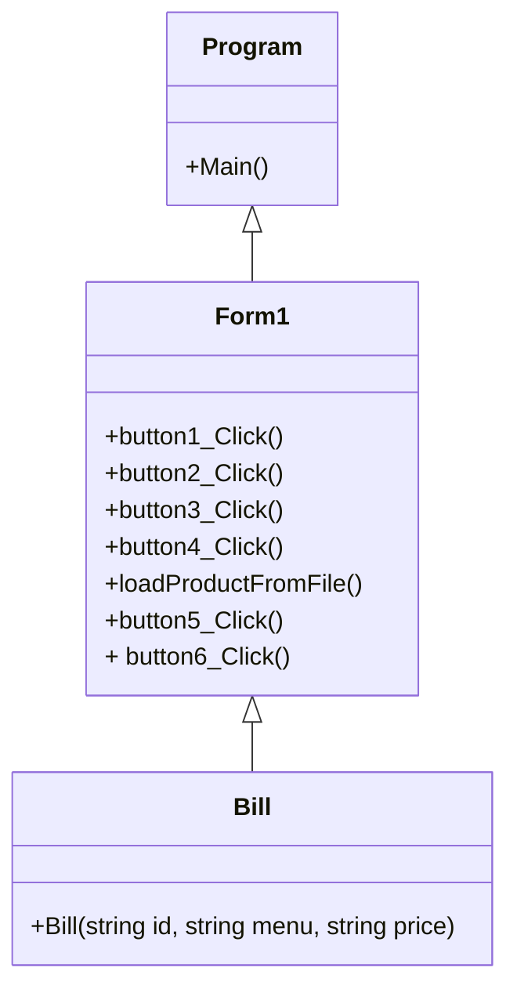

## YesMan141 Coffee
### ความเป็นมาของโปรแกรม
ส่วนตัวกระผมนั้นชื้นชอบในการดื่มกาแฟจึงได้ทอดลองสร้างโปรแกรมร้านกาแฟขึ้นมา
  
### วัตถุประสงค์ของโปรแกรม
พัฒนาขึ้นมาเพื่อใช้ในการศึกษาและเรียนรู้ในการเขียนโปรแกรมและเพื่อการพัฒนาในอนาคต

  
### โครงสร้างของโปรแกรม

  
### ผู้พัฒนาโปรแกรม
นายปรเมศวร์ สิทธิมงคล
643450078-5
